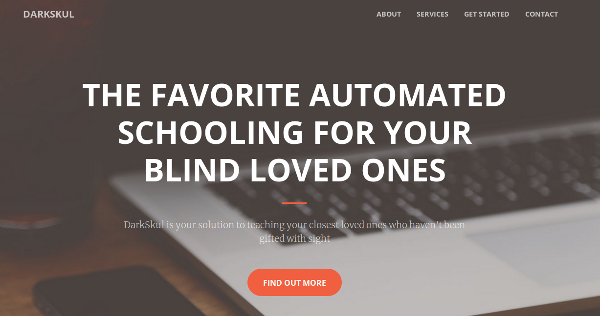

## CBSE Syllabus ChatOps
A CBSE course summarizer with a chat bot interface

 

### Features

- [X] Course summarizer
- [X] Chat interface
- [X] Support for different languages
- [X] Granular commands, such as reading a particular chapter
- [X] Web preview
- [X] Course fetch and seed summarizer

This chatbot includes a built in voice module so that even blind people can study at the last minute.

Made with :heart: by Sheryl
